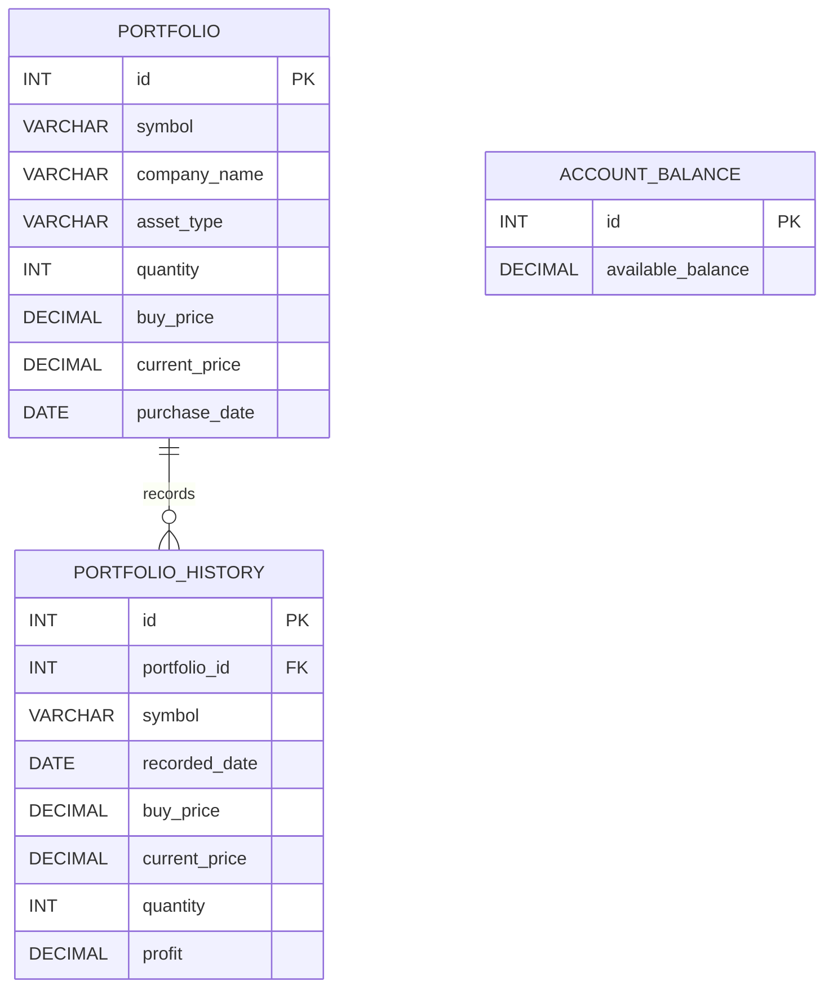

# Portfolio Manager ER Diagram

## Notes

- account_balance currently stores a single seeded row (id = 1) for app-level available balance.
- portfolio_history.portfolio_id references portfolio.id in application logic.
- The relationship shown is one portfolio holding to many history snapshots.
